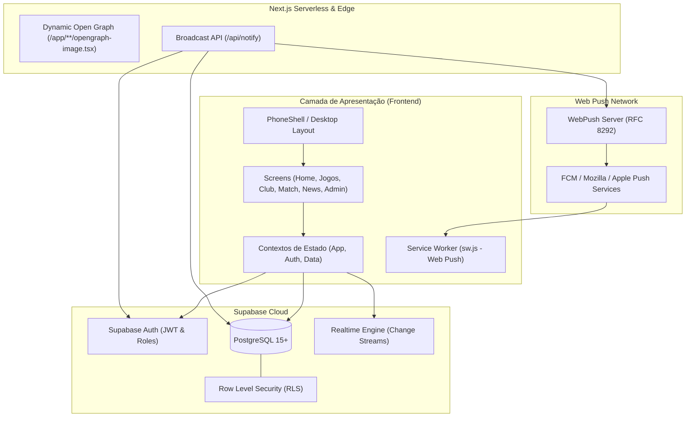

<div align="center">

  

  # CPM MamoBall

  **Plataforma oficial de gestão, classificação e acompanhamento em tempo real da liga de MamoBall.**

  [](https://nextjs.org/)
  [](https://react.dev/)
  [](https://www.typescriptlang.org/)
  [](https://tailwindcss.com/)
  [](https://supabase.com/)
  [](https://developer.mozilla.org/en-US/docs/Web/API/Push_API)
  [](LICENSE)

  <br />

  <p align="center">
    <a href="#-principais-funcionalidades">Funcionalidades</a> •
    <a href="#-arquitetura-e-engenharia">Arquitetura</a> •
    <a href="#-modelo-de-dados">Modelo de Dados</a> •
    <a href="#-stack-tecnol%C3%B3gica">Stack Tecnológica</a> •
    <a href="#-instala%C3%A7%C3%A3o-e-execu%C3%A7%C3%A3o">Instalação</a> •
    <a href="#-vari%C3%A1veis-de-ambiente">Variáveis de Ambiente</a>
  </p>

</div>

---

## 📌 Visão Geral do Produto

O **CPM MamoBall** é um ecossistema completo de gestão esportiva desenvolvido para ligas competitivas do jogo **MamoBall**. Desenvolvido com foco em alta performance, estética esportiva contemporânea (*dark mode* com paleta de contraste refinada) e responsividade absoluta, o sistema entrega tanto a experiência de um aplicativo mobile nativo quanto um dashboard robusto para desktop.

A plataforma unifica a experiência dos atletas e torcedores com uma suíte administrativa que simplifica o gerenciamento de campeonatos, calendários de jogos, súmulas em tempo real, artilharia, transferências de elencos e notificações instantâneas via Web Push.

---

## 🚀 Principais Funcionalidades

<table>
  <tr>
    <td width="50%">
      <h3>🏟️ Hub de Partidas & Ticket-Stub</h3>
      <ul>
        <li>Placares ao vivo e súmula completa pós-jogo.</li>
        <li>Hero de partida com design estilo <em>ticket-stub</em>, com picote perfurado e tipografia digital esportiva.</li>
        <li>Linha do tempo dinâmica com registro de gols, assistências, gols contra e identificação de atletas.</li>
      </ul>
    </td>
    <td width="50%">
      <h3>📊 Classificação em Tempo Real</h3>
      <ul>
        <li>Tabela dinâmica por competição com cálculo automático de pontos (P), jogos (J), vitórias (V), empates (E), derrotas (D), saldo de gols (SG) e gols pró/contra.</li>
        <li>Pílulas de forma recente (V / E / D) das últimas rodadas.</li>
        <li>Ordenação automática por critérios de desempate da liga.</li>
      </ul>
    </td>
  </tr>
  <tr>
    <td width="50%">
      <h3>🛡️ Perfis de Clubes & Elencos</h3>
      <ul>
        <li>Páginas dedicadas com extração de paleta de cores dos escudos via algoritmo de colorimetria no canvas.</li>
        <li>Listagem de elenco oficial com posições táticas: Goleiro (<code>GK</code>), Volante (<code>VL</code>), Meia Central (<code>MC</code>) e Pivô/Atacante (<code>PV/ATK</code>).</li>
        <li>Identificação visual de capitães e histórico de desempenho.</li>
      </ul>
    </td>
    <td width="50%">
      <h3>🔔 Notificações Web Push (PWA)</h3>
      <ul>
        <li>Suporte nativo a Web Push via Service Worker e protocolo VAPID.</li>
        <li>Notificações em tempo real para início de partidas, resultados e comunicados urgentes.</li>
        <li>Gerenciamento automático de inscrições e descarte de endpoints expirados (códigos 404/410).</li>
      </ul>
    </td>
  </tr>
  <tr>
    <td width="50%">
      <h3>📰 Central Editorial & Notícias</h3>
      <ul>
        <li>Feed integrado com categorias dedicadas: <em>notícia</em>, <em>inscrições</em>, <em>comunicado</em> e <em>resultado</em>.</li>
        <li>Estimativa de tempo de leitura, autor e tags contextuais vinculadas a torneios ou partidas.</li>
      </ul>
    </td>
    <td width="50%">
      <h3>⚙️ Painel Administrativo com RBAC</h3>
      <ul>
        <li>Área de controle exclusiva para staff e comissão organizadora.</li>
        <li>Segurança reforçada por <strong>Row Level Security (RLS)</strong> no PostgreSQL.</li>
        <li>Criação de torneios, agendamento de partidas, lançamento de súmulas e envio de broadcasts.</li>
      </ul>
    </td>
  </tr>
  <tr>
    <td width="50%">
      <h3>🖼️ Open Graph Dinâmico Server-Side</h3>
      <ul>
        <li>Geração programática de cartões visuais para redes sociais (<code>@vercel/og</code>).</li>
        <li>Pré-visualizações dinâmicas no Discord, WhatsApp e Twitter para links de clubes, partidas e matérias.</li>
      </ul>
    </td>
    <td width="50%">
      <h3>📱 Mobile-First com Split Desktop</h3>
      <ul>
        <li>Shell adaptativo (<code>PhoneShell</code>) que emula ergonomia de app no mobile.</li>
        <li>Expansão fluida para layout de múltiplas colunas (<code>.d-split</code>) em monitores grandes.</li>
      </ul>
    </td>
  </tr>
</table>

---

## 🏗️ Arquitetura e Engenharia

O projeto adota uma arquitetura orientada a serviços leves (*BaaS* com Supabase e Serverless API Routes no Next.js):



---

## 🗄️ Modelo de Dados

O banco de dados relacional é orquestrado no PostgreSQL via Supabase. A estrutura integral e triggers estão documentados em [`supabase/schema.sql`](supabase/schema.sql):

| Tabela | Descrição |
| :--- | :--- |
| `clubs` | Cadastro das agremiações, cores primária/secundária, tag e logotipo. |
| `competitions` | Campeonatos, temporadas, status (`planejado`, `inscricoes`, `em_andamento`, `encerrado`). |
| `players` | Atletas cadastrados, ID único de jogo (MamoBall ID), Discord, posição e capitania. |
| `club_competitions` | Relação N:N de clubes inscritos por edição/competição. |
| `player_competitions` | Relação N:N de jogadores aptos por competição. |
| `matches` | Partidas, rodadas, datas, placares, súmulas estruturadas em JSONB (`home_scorers`, `away_scorers`) e flags de WO. |
| `standings` | Tabela de classificação consolidada com pontuação e histórico de forma. |
| `news` | Artigos e comunicados oficiais da liga vinculados a partidas ou competições. |
| `push_subscriptions` | Endpoints e chaves criptográficas (`p256dh`, `auth`) para disparo de Web Push. |
| `profiles` | Perfis de usuários com controle de papéis (`staff` vs usuário comum) protegidos por RLS. |

---

## 💻 Stack Tecnológica

| Camada | Tecnologia | Propósito |
| :--- | :--- | :--- |
| **Framework** | [Next.js 16 (App Router)](https://nextjs.org/) | Renderização híbrida, rotas de API serverless e Turbopack |
| **Linguagem** | [TypeScript 5](https://www.typescriptlang.org/) | Tipagem estática rigorosa e contratos de domínio |
| **Interface** | [React 19](https://react.dev/) + [Tailwind CSS v4](https://tailwindcss.com/) | Componentização reativa e estilização utilitária |
| **Banco & Auth** | [Supabase](https://supabase.com/) | PostgreSQL, Autenticação JWT, Row Level Security e Realtime |
| **Notificações** | [web-push](https://www.npmjs.com/package/web-push) | Envio de notificações push criptografadas VAPID |
| **Geração Social** | `next/og` (`@vercel/og`) | Renderização de Open Graph cards dinâmicos via Edge Runtime |
| **E2E & Testes** | [Playwright](https://playwright.dev/) | Automação e verificação de rotas e interface |

---

## 🛠️ Instalação e Execução

### Pré-requisitos
- **Node.js**: versão `20.x` ou superior
- **npm**, **pnpm** ou **yarn**
- Instância ativa no [Supabase](https://supabase.com/)

### 1. Clonar o Repositório
```bash
git clone https://github.com/S4CodeWorks/cpmmamoball.git
cd cpmmamoball
```

### 2. Instalar Dependências
```bash
npm install
```

### 3. Configurar Variáveis de Ambiente
Copie o arquivo de exemplo para o seu ambiente local:
```bash
cp .env.example .env.local
```
Abra o `.env.local` e informe as credenciais do seu projeto Supabase e as chaves VAPID para Web Push.

### 4. Inicializar o Banco de Dados
No painel do Supabase, acesse o **SQL Editor**, cole e execute todo o conteúdo de:
```
supabase/schema.sql
```

### 5. Executar o Servidor de Desenvolvimento
```bash
npm run dev
```
Acesse [http://localhost:3000](http://localhost:3000) no seu navegador.

---

## 🔐 Variáveis de Ambiente

As variáveis de ambiente controlam as integrações com serviços externos:

| Variável | Obrigatória | Descrição |
| :--- | :---: | :--- |
| `NEXT_PUBLIC_SUPABASE_URL` | Sim | URL pública da API do seu projeto Supabase. |
| `NEXT_PUBLIC_SUPABASE_ANON_KEY` | Sim | Chave de API pública (`anon`) com permissões controladas por RLS. |
| `NEXT_PUBLIC_VAPID_PUBLIC_KEY` | Opcional* | Chave pública VAPID para registro de inscrições no navegador. |
| `VAPID_PRIVATE_KEY` | Opcional* | Chave privada VAPID utilizada pelo endpoint `/api/notify`. |
| `VAPID_SUBJECT` | Opcional* | Contato no formato `mailto:seu-email@dominio.com` para a especificação VAPID. |

*\* Necessárias apenas para o funcionamento do sistema de notificações Web Push.*

Para gerar as chaves VAPID rapidamente:
```bash
npx web-push generate-vapid-keys
```

---

## 📂 Estrutura do Projeto

```
cpmmamoball/
├── app/                        # Next.js App Router
│   ├── api/notify/             # Rota serverless de disparo de Web Push
│   ├── clube/[id]/             # Rota dinâmica e Open Graph de clubes
│   ├── noticia/[id]/           # Rota dinâmica e Open Graph de notícias
│   ├── partida/[id]/           # Rota dinâmica e Open Graph de partidas
│   ├── admin/                  # Rota direta para painel staff
│   ├── layout.tsx              # Layout raiz, fontes e metadados
│   └── page.tsx                # Entrada principal da aplicação
├── components/                 # Componentes reutilizáveis
│   ├── screens/                # Telas completas da aplicação (Home, Match, Club...)
│   ├── ui/                     # Primitives, cards, botões, modais e skeletons
│   ├── icons.tsx               # Conjunto de ícones vetoriais em SVG
│   └── PhoneShell.tsx          # Shell adaptativo (Mobile viewport / Desktop expandido)
├── contexts/                   # Provedores de contexto React
│   ├── AppContext.tsx          # Navegação, toasts e histórico de telas
│   ├── AuthContext.tsx         # Estado de sessão e autorização de staff
│   └── DataContext.tsx         # Cache, sincronização e requisições Supabase
├── hooks/                      # React Hooks utilitários (useIsDesktop, etc.)
├── lib/                        # Regras de negócio e utilitários
│   ├── constants.ts            # Configurações globais da temporada
│   ├── db.ts                   # Queries e mutations com Supabase
│   ├── extractColors.ts        # Extração dinâmica de cores do escudo
│   ├── push.ts                 # Registro e inscrição de Web Push no cliente
│   ├── routes.ts               # Resolução de URLs canônicas
│   ├── supabase.ts             # Cliente inicializado do Supabase
│   └── types.ts                # Definições estritas de tipos em TypeScript
├── public/                     # Ativos estáticos e Service Worker
│   ├── logo-cfm.png            # Escudo oficial da liga
│   ├── escudo-generico.png     # Escudo padrão fallback
│   └── sw.js                   # Service worker nativo para Web Push
├── scripts/                    # Scripts utilitários e de automação
│   └── tour.mjs                # Automação Playwright para gravação de tours
├── supabase/                   # Governança de banco de dados
│   └── schema.sql              # Schema DDL, triggers e políticas RLS
├── CONTRIBUTING.md             # Guia de colaboração e padrões de código
├── LICENSE                     # Licença MIT
└── README.md                   # Documentação oficial do projeto
```

---

## 📜 Scripts Disponíveis

- `npm run dev`: Inicia o servidor local com Turbopack em modo de desenvolvimento.
- `npm run build`: Compila a aplicação otimizada para ambiente de produção.
- `npm run start`: Executa o build de produção localmente.
- `npm run lint`: Valida conformidade de padrões com ESLint.
- `npm run tour`: Executa o roteiro automatizado do Playwright pelas rotas da aplicação.

---

## 🤝 Contribuição

Contribuições são muito bem-vindas! Para diretrizes sobre branches, convenções de commits e padrões de código, leia o nosso arquivo [CONTRIBUTING.md](CONTRIBUTING.md).

---

## 📄 Licença

Distribuído sob a licença **MIT**. Consulte o arquivo [`LICENSE`](LICENSE) para mais detalhes.

<div align="center">
  <sub>Desenvolvido com excelência por <a href="https://github.com/S4CodeWorks">S4CodeWorks</a>.</sub>
</div>
